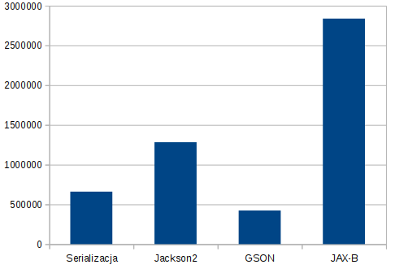
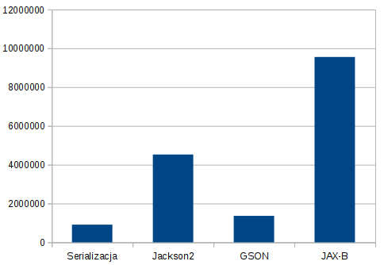

# Serializacja benchmark

Porównywane metody:

* Serializable
* JSON – Jackson2
* GSON
* JAX-B

Ilość serializowanych obiektów

* Jeden obiekt
* Lista zawierająca 10 obiektów
* Lista zawierająca 10 tys obiektów

Wynik

`mvn compile exec:java`

## jeden obiekt: 

## Lista 10 obiektów: 

## Lista 10 tys. obiektów: 

