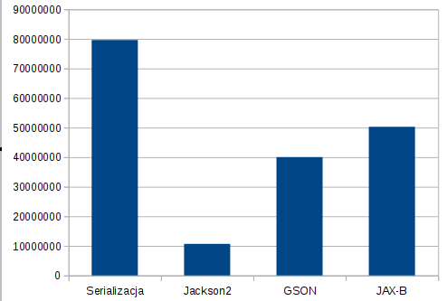

# Serializacja benchmark

Porównywane metody:

* Serializable
* JSON – Jackson2
* GSON
* JAX-B

Ilość serializowanych obiektów

* Jeden obiekt
* Lista zawierająca 10 obiektów
* Lista zawierająca 10 tys obiektów

Wynik

`mvn compile exec:java`

## jeden obiekt: 

## Lista 10 obiektów: 

## Lista 10 tys. obiektów: 

Sprzęt:
openjdk version "1.8.0_91"
OpenJDK 64-Bit Server VM (build 25.91-b14, mixed mode)
Linux debian 4.5.0-2-amd64 #1 SMP Debian 4.5.4-1 (2016-05-16) x86_64 GNU/Linux
Intel(R) Core(TM) i5-3230M CPU @ 2.60GHz